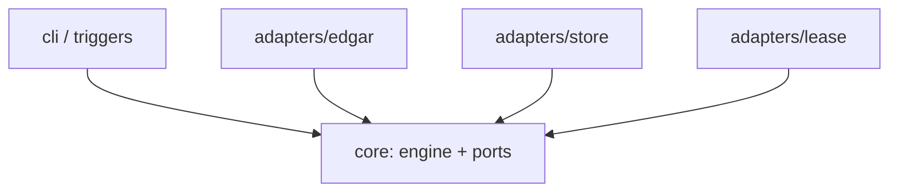
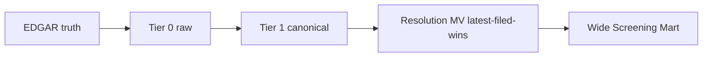
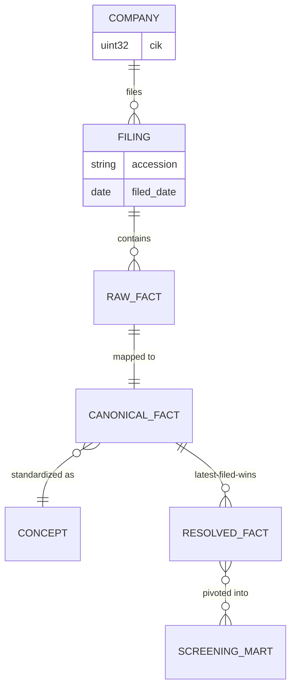
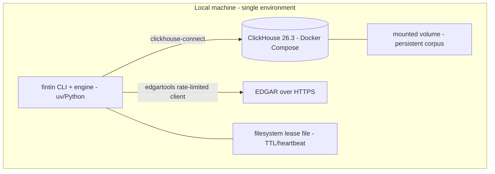

# Architecture Spine — fin-tin

## Design Paradigm

**Ports & Adapters (Hexagonal)** around a pure ingestion engine, feeding a **layered data-derivation pipeline**.

- **Core** (`fintin/core/`) — the pure catch-up/reconciler domain: work-list derivation, resolution rules, orchestration. No I/O; depends on nothing outward. Defines ports for EDGAR fetch, fact store, and lease.
- **Adapters** — implement the ports: `fintin/adapters/edgar/` (the one rate-limited EDGAR client + backfill strategies), `fintin/adapters/store/` (ClickHouse schema/DDL, repositories, mart), `fintin/adapters/lease/` (filesystem lease).
- **Triggers (driving adapters)** (`fintin/cli/`) — dumb invokers of the core command; v1 = Typer CLI.
- **Data pipeline** — one-way derivation: EDGAR → **Tier 0** (raw) → **Tier 1** (canonical) → **Resolution MV** (latest-filed-wins) → **Wide Screening Mart**. Each stage derives from the one before; dependencies never point backward.

## Invariants & Rules

Dependency direction (adapters and triggers depend inward on core ports; core depends on nothing):



Data derivation direction (one-way; recovery re-derives leftward, never rightward):



### AD-1 — Derive state, never maintain a driftable copy `[ADOPTED]`
- **Binds:** all
- **Prevents:** a second copy of progress/state that can disagree with reality
- **Rule:** No component persists a progress cursor, checkpoint file, or ingestion ledger. Outstanding work is computed at run time from the DB (+ EDGAR's index). The only permitted operational state is the single-flight lease (AD-12); the ad-hoc-repair suspect queue is the one documented exception and is out of v1 (see Deferred).

### AD-2 — Pure engine, dumb pluggable triggers `[ADOPTED]`
- **Binds:** core, cli, all trigger types
- **Prevents:** triggers embedding policy/throttle; divergent entrypoints
- **Rule:** The catch-up engine is a pure command with no knowledge of its caller. Every trigger (CLI in v1; cron/RSS/HTTP later) invokes that same command. Throttle (AD-3) and single-flight (AD-12) live inside the engine, never in a trigger.

### AD-3 — All EDGAR access through one rate-limited client `[ADOPTED]`
- **Binds:** any code touching EDGAR
- **Prevents:** uncoordinated or under-counted requests → ban
- **Rule:** Every EDGAR request goes through the single EDGAR client. Because edgartools owns the socket and may fan out sub-requests, the ceiling is enforced at **edgartools' own throttle** (configured to ≤ **10 req/s**, the SEC aggregate max), never a naive per-call wrapper. The client sets the **declared identifying User-Agent** (`edgar.set_identity`, from config) and `Accept-Encoding: gzip, deflate`, honors `Retry-After` if present, and otherwise self-imposes a **≥10-minute cool-down** on a throttle-failure. No direct HTTP to EDGAR exists anywhere else.

### AD-4 — Two-tier store with one-way recovery hierarchy `[ADOPTED]`
- **Binds:** storage, ingestion, mapping
- **Prevents:** lossy dead-ends; re-hitting EDGAR for routine work
- **Rule:** Tier 0 = immutable raw landing hoarding all standard-taxonomy facts. Tier 1 = canonical, rebuildable from Tier 0 with **zero network**. Recovery flows one way only: EDGAR → Tier 0 → Tier 1 → Resolution → Mart. Tier 1 is never a source for raw data.

### AD-5 — Tier 1 keyed by raw-fact identity `[ADOPTED]`
- **Binds:** Tier 1 schema, re-map
- **Prevents:** re-map orphaning stale rows / generating duplicates
- **Rule:** Tier 1 identity = `(accession, raw_tag, period_start, period_end, unit)` (same shape as Tier 0, AD-15). `canonical_concept`, `taxonomy_version`, `raw_label`, `filed_date`, `content_hash` are attributes, never part of the key. A re-map is an in-place upsert on this key.

### AD-6 — Insert-only mutation; ingest-monotonic version; correctness at read
- **Binds:** Tier 0, Tier 1, every writer and reader
- **Prevents:** builders diverging on updates; recovery failing to overwrite; reading pre-merge duplicates as truth
- **Rule:** Tier 0 and Tier 1 are `ReplacingMergeTree(version)` sorted by their identity key. The **`version` column is ingest-monotonic** (an ingest sequence/timestamp) — **not** `filed_date` — so a recovery re-ingest always supersedes a corrupted prior copy regardless of filing dates. All writes are **inserts** (idempotent by key); no `UPDATE`/`DELETE` in normal operation. Readers **must** use `FINAL` or an `argMax` aggregation and must never assume a background merge has run. Latest-filed-wins is a read-time concern (AD-7), never the merge's job.

### AD-7 — Latest-filed-wins on actual period dates, deterministic tiebreak `[ADOPTED]`
- **Binds:** Tier 1 reads, resolution MV, any queryable value
- **Prevents:** stale/superseded values; fiscal-label grouping errors; nondeterministic ties
- **Rule:** The resolved value for `(cik, canonical_concept, unit, period_start, period_end)` is `argMax(value, filed_date)`. Group on **actual period dates**, never `fy`/`fp` labels. On an equal-`filed_date` tie the order is: prefer a `/A` amendment, then the lexicographically greatest `accession` — deterministic. All filed versions are retained (restatement history is inferred from filed-date divergence, not a flag).

### AD-8 — Resolution MV + wide screening mart
- **Binds:** mart, query surface (FR-13)
- **Prevents:** divergent resolution/refresh logic; a stale, manually-refreshed, or long-shaped mart
- **Rule:** Over Tier 1: (1) the **wide Screening Mart** — a *view* presenting **one row per `(cik, period_start, period_end)`** whose columns are the **concept dictionary** (each screening concept = an ordered list of standard elements). Each column resolves to the **latest-filed** value across that concept's element union, with the AD-7 filing rank `(filed_date, /A, accession, version)` and **element list-position** as the deterministic tiebreak — computed **directly over `canonical_fact FINAL`**. Because it is derived on read (no stored concept-level copy), it always reflects the current dictionary and never drifts (**AD-1**); editing the dictionary is a `CREATE OR REPLACE VIEW`, not a data rebuild. This is the screening surface (FR-13; derived-metric columns deferred, §Deferred). (2) an **element-grained Resolution MV** — `resolved_fact` (`AggregatingMergeTree` of `argMaxState(value, (filed_date, is_amendment, accession, version))` per `(cik, canonical_concept=element, unit, period)`, auto-populated on Tier 1 insert) — is **retained for element-level / ad-hoc resolution**, NOT as the mart's source. Both are created before any backfill insert (AD-18). The concept dictionary is a **versioned artifact owned by `adapters/store`**. `canonical_concept` is the element verbatim (AD-9), so Tier 1 recovery re-derives everything losslessly with no column-retraction hazard. _(Rationale: the mart resolves the dictionary on read rather than materializing a concept-level copy — chosen so there is no derived table to fall out of sync with the dictionary or Tier 1, per AD-1. A materialized/cached mart may be added later as a pure optimization, validated against this view, if screen latency ever requires it.)_

### AD-9 — Concept dimension = the standard element; comparability via a curated concept dictionary `[ADOPTED]`
- **Binds:** the Tier 0 → Tier 1 projection, the concept space, the screening mart
- **Prevents:** incomparable concepts; a lossy/ambiguous statistical concept map; scope creep into custom extensions
- **Rule:** The canonical concept is the **standard XBRL element itself** — Tier 1 `canonical_concept` = the `us-gaap`/`dei`/`srt` element local name (`Assets`, `RevenueFromContractWithCustomerExcludingAssessedTax`, …), a **1:1 lossless** projection of the Tier 0 `raw_tag` (namespace stripped). This is unambiguous and exact by construction: each element is FASB-defined and identical across filers, so **no statistical standardization is stored**. Only `us-gaap`/`dei`/`srt` facts are ingested; custom-extension elements are out of scope and surface as coverage gaps (FR-14), never silent errors. Cross-company **screening** concepts (revenue, net income, …) come from a **versioned concept dictionary** (AD-8): each concept = an ordered list of standard elements (FASB-primary + observed-frequency-ranked fallbacks), resolved by **first-present precedence**. edgartools' *learned* standardization taxonomy is NOT authoritative (avg confidence ≈ 0.5; ~80% of its concepts collapse many tags) and is used only, if at all, as a research aid to seed dictionary candidates — never as the stored concept. Every Tier 1 row carries `taxonomy_version` (carried over from Tier 0; AD-14).

### AD-10 — Work is derived; "catch up to today" is the only behavior `[ADOPTED]`
- **Binds:** core reconciler, ingestion
- **Prevents:** a maintained cursor that drifts; a "missed run" concept
- **Rule:** Catch-up is the sole ingestion operation. Work = newly-filed accessions discovered via EDGAR's index (`edgar.get_filings(filing_date=…)`) minus those already present, scanned over a window (AD-16). An empty delta is a no-op. There is no stored cursor.

### AD-11 — Universal resumability via per-company idempotent commits `[ADOPTED]`
- **Binds:** all long operations (backfill, delta, re-map, scrub)
- **Prevents:** lost progress on crash; a checkpoint file (a driftable copy — AD-1)
- **Rule:** Commit at **per-company** grain (never one final write). Resume-after-crash re-derives the gap from the DB (AD-16 membership); there is no checkpoint file.

### AD-12 — Single-flight via a self-expiring filesystem lease; coalesce
- **Binds:** engine invocation, concurrency
- **Prevents:** concurrent runs doubling the EDGAR rate (ban); stale-lock deadlock
- **Rule:** At most one run at a time, guarded by a **filesystem lease file** (path from config; default under the data dir) with a **heartbeat interval ≪ TTL**. A trigger during an active (heartbeating) run returns `ALREADY_RUNNING` (exit-0) and does nothing — coalesce, don't queue. An **expired** lease is reclaimed and its partial work resumed. A run inside an EDGAR cool-down (AD-3) keeps heartbeating so its lease is not reclaimed mid-cool-down. Status vocabulary — `STARTED` / `ALREADY_RUNNING` / `NOTHING_TO_DO` / `COMPLETED` — all exit-0.

### AD-13 — Backfill is strategy-pluggable behind one interface
- **Binds:** backfill, Universe expansion (FR-7)
- **Prevents:** a redesign when the Universe grows beyond S&P 500
- **Rule:** Backfill is one interface with swappable strategies selected by Universe size. v1 implements the **per-company `companyfacts` API** strategy (S&P 500 scale) — this resolves PRD Open Q#2 and is the small-curated-Universe path FR-7 already permits. The **bulk `companyfacts.zip`** strategy is the large/full-market path (deferred). The Universe is a config list of CIKs; tickers resolve to CIKs via edgartools at load.

### AD-14 — Provenance retained; recovery is a scoped re-ingest `[ADOPTED]`
- **Binds:** Tier 0, recovery (FR-6)
- **Prevents:** unrecoverable corruption; taxonomy-coupling dead-ends
- **Rule:** Every fact carries `raw_tag`, `raw_label`, `filed_date`, `content_hash` (= sha256 over the normalized raw-fact tuple), `taxonomy_version` (edgartools version string). Tier 0 recovery = re-ingest the target accession/company through the normal throttled path (idempotent, ingest-monotonic version supersedes the corrupted copy, AD-6) and re-derive downstream (Tier 1 → Resolution → Mart, AD-8). `content_hash` detects at-rest corruption. Automated detection (scrub) is Should; ad-hoc reactive repair is the deferred exception.

### AD-15 — Tier 0 physical key; consolidated facts only
- **Binds:** Tier 0 schema, ingestion
- **Prevents:** segmented/dimensional facts collapsing under one key or forking the schema between builders
- **Rule:** Tier 0 identity = `(accession, raw_tag, period_start, period_end, unit)`. v1 ingests **consolidated facts only** — dimensional/segment axis members (by geography, product, etc.) are **not** ingested, so no two rows share that key. (Ingesting dimensional breakdowns would require adding a `dimensions` term to this key and AD-5's; deferred.)

### AD-16 — Membership is the correctness authority; HWM is only a hint
- **Binds:** the reconciler's work-list derivation
- **Prevents:** a global high-water mark + out-of-order per-company commits silently skipping earlier uncommitted filings (would violate SM-3)
- **Rule:** The correctness boundary is **per-accession membership** (does this accession already exist in the store?) checked over a reordering-safe **lookback window** (a `LOOKBACK` config spanning the plausible filing-order skew). `SELECT max(filed)` is only a scan-bounding hint that sizes the window, never the thing that decides done-ness.

### AD-17 — Period representation
- **Binds:** every layer that keys or groups by period (AD-5, AD-7, AD-8, AD-15)
- **Prevents:** balance-sheet (instant) facts forking into two keys, or duration facts mismatching, between builders
- **Rule:** **Instant** facts (balance-sheet items) are stored `period_start = period_end = instant_date`. **Duration** facts (flows: income, cash-flow) are stored `period_start < period_end`. This representation is uniform across all tiers and the mart.

### AD-18 — Single owner of schema/DDL; creation order
- **Binds:** `adapters/store`, migrations, bootstrap
- **Prevents:** split DDL ownership breaking the "MV before backfill" rule; divergent schema between components
- **Rule:** One component (`adapters/store`) owns all ClickHouse DDL and migrations. Bootstrap creates Tier 0, Tier 1, the Resolution MV, and the wide Mart **before** any backfill insert (ClickHouse MVs do not backfill pre-existing rows). No other component issues DDL.

## Consistency Conventions

| Concern | Convention |
| --- | --- |
| Naming — Python | Packages/modules `snake_case` under `fintin/`; one adapter package per port. |
| Naming — ClickHouse | Tables/columns `snake_case`: `raw_fact` (Tier 0), `canonical_fact` (Tier 1), `resolved_fact` (MV), `screening_mart` (wide view). `canonical_concept` values = the `us-gaap`/`dei`/`srt` element local name verbatim (AD-9); screening-concept mart columns are defined by the versioned concept dictionary (AD-8). |
| Identity | `cik` = `UInt32` (numeric canonical; zero-padded to 10 digits only for SEC URLs). `accession` = dashed 20-char canonical form (`0000320193-24-000123`), normalized on ingest. |
| Data & formats | `value` = `Float64` (screening-adequate; Decimal deferred if exactness ever needed). `period_start`/`period_end`/`filed_date` = `Date` (per AD-17). `unit` = `String` (`USD`, `shares`, `USD/shares`). `taxonomy_version` = `String`. |
| State & mutation | Insert-only into `ReplacingMergeTree` with ingest-monotonic `version` (AD-6); no `UPDATE`/`DELETE` in normal ops; reads via `FINAL`/`argMax`. |
| Errors & status | Runs fail loudly except: throttle → cool-down+retry (AD-3); active run → `ALREADY_RUNNING` (AD-12). A **per-company ingest failure is recorded, not fatal** — the run continues and the coverage report (FR-14) lists zero-fact/failed companies as **explained gaps** (SM-2). Exit codes: AD-12 vocabulary, all exit-0. |
| Testing | EDGAR-touching code is tested against **recorded fixtures**; never hit live EDGAR in tests/CI (ban risk). SM-1's restatement test set is a fixture. |
| Logging & config | Structured logging to stdout. Single TOML config: Universe (CIK/ticker list), rate ceiling, identifying User-Agent + contact email, ClickHouse connection, lease path, `LOOKBACK`. No secrets store (local). |

## Stack

| Name | Version |
| --- | --- |
| Python | ≥ 3.12 |
| ClickHouse (server) | 26.3 (LTS) |
| edgartools | 5.43.0 |
| clickhouse-connect | 1.6.0 |
| Typer | 0.27.0 |
| uv (tooling) | 0.11.32 |
| Docker Compose (ClickHouse host) | host-provided |

## Structural Seed

Core entities (names + relationships; invariant attributes live in the ADs):



Deployment / operational envelope (single local node):



Source tree:

```text
fin-tin/
  pyproject.toml            # uv-managed; requires-python >=3.12
  docker-compose.yml        # ClickHouse 26.3 single node + volume
  fintin.toml               # config: Universe, rate ceiling, identity, CH conn, lease path, LOOKBACK
  fintin/
    core/                   # pure engine: reconciler, catch-up, resolution, membership, ports
    adapters/
      edgar/                # one edgartools-throttled client; backfill strategies (per-company v1)
      store/                # ClickHouse DDL/migrations (sole owner), repositories, resolution MV + wide mart
      lease/                # filesystem single-flight lease
    cli/                    # Typer triggers (catch-up, backfill, status)
  tests/
    fixtures/               # recorded EDGAR responses; SM-1 restatement test set
```

## Capability → Architecture Map

| Capability | Lives in | Governed by |
| --- | --- | --- |
| FR-1 rate-limited client / FR-2 request-count min | `adapters/edgar` | AD-3, AD-13 |
| FR-3 Tier 0 / FR-4 Tier 1 / FR-5 latest-filed-wins | `adapters/store` | AD-4, AD-5, AD-6, AD-7, AD-9, AD-15, AD-17 |
| FR-6 Tier 0 recovery | `adapters/edgar` + `core` | AD-14, AD-6, AD-4 |
| FR-7 backfill / FR-8 catch-up / FR-9 derived work list | `core` + `adapters/edgar` | AD-10, AD-11, AD-13, AD-16 |
| FR-10 resumability / FR-11 single-flight | `core` + `adapters/lease` | AD-11, AD-12, AD-16 |
| FR-12 pure engine / decoupled trigger | `core` + `cli` | AD-1, AD-2 |
| FR-13 screening mart | `adapters/store` | AD-8, AD-7, AD-18 |
| FR-14 coverage & status | `cli` + `adapters/store` | AD-10, AD-16, Errors & status convention |

## Deferred

- **Bulk `companyfacts.zip` backfill strategy** — the large/full-market path (AD-13); build when the Universe outgrows per-company scale.
- **Dynamic S&P 500 membership sourcing** — v1 uses a static config list.
- **Proactive integrity scrub (`last_verified_at`) + at-rest hash automation** — Should; the detection side of AD-14.
- **Derived-metrics columns (margins/ratios)** — Should; additional columns on the wide Mart (AD-8).
- **Concept-dictionary expansion & automation** — Should; v1 curates a small dictionary (the headline screening concepts) seeded by observed frequency. Forward work: broaden concept coverage, pin the dictionary to a FASB UGT taxonomy year, and auto-seed candidate element lists from the FASB calculation linkbase / SEC Frames frequency instead of by hand (AD-8, AD-9).
- **Dimensional/segment facts** — Won't (v1); would extend the AD-15/AD-5 key with a `dimensions` term.
- **Re-map (taxonomy vX→vY) as a first-class command** — largely **obviated by AD-9's pivot**: `canonical_concept` is the element verbatim, so there is no lossy concept re-mapping and no MV column-retraction hazard. Changing cross-company unification is now a concept-dictionary edit (a `CREATE OR REPLACE` mart-view change, AD-8), not a Tier 1 re-map. Retained only for the narrow case of re-projecting Tier 1 after a Tier 0 recovery (AD-14), which the AD-5/AD-6 upsert already handles.
- **cron / RSS / HTTP triggers; "catch up before query"** — Could; each a thin wrapper per AD-2.
- **Point-in-time / backtesting surface (`pit_mode`); 8-K Item 4.02 early-warning feed** — Could.
- **Ad-hoc reactive corruption repair + ephemeral suspect-accession queue** — Won't (v1); the one deliberate exception to AD-1.
- **Foreign/IFRS filers; multi-user/UI** — Won't (v1).
