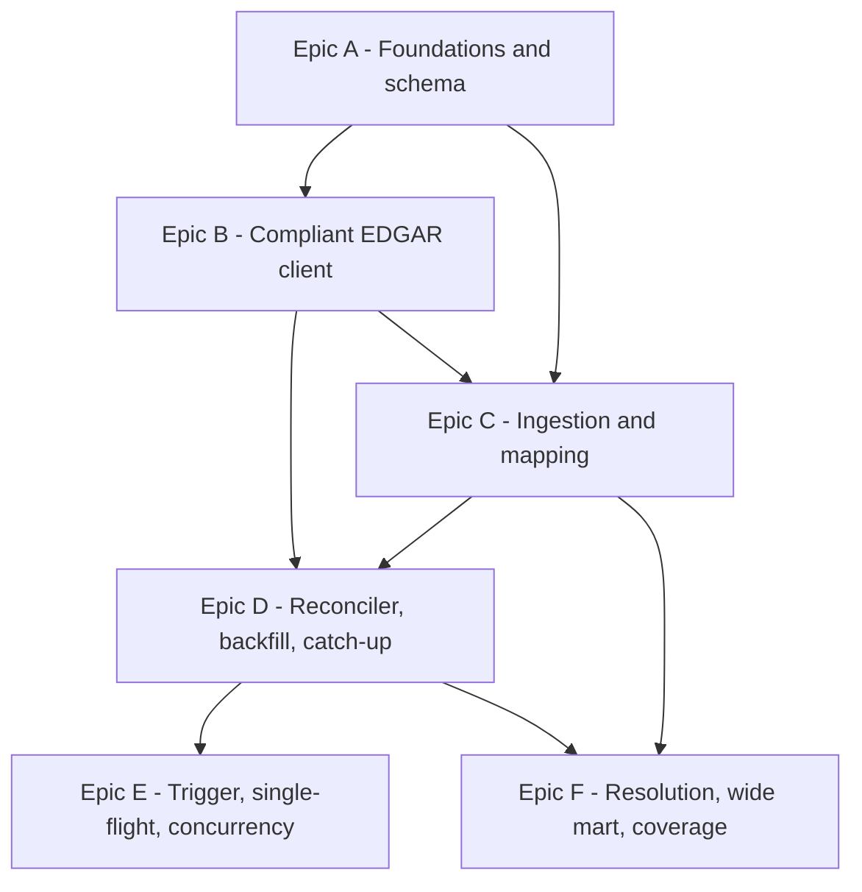

# fin-tin — Build-Split View

How the v1 spine (`ARCHITECTURE-SPINE.md`) splits into build units for sequencing. Six epics, dependency-ordered; each names the FRs it delivers and the ADs it must obey. Intended as input to `bmad-create-epics-and-stories`.

## Dependency graph

## Build sequence

**A → B → C → D → E**, with **F** starting after C (the mart) and finishing after D (coverage needs ingestion). B can begin alongside the tail of A. The critical path is A → C → D → E.

---

## Epic A — Foundations & schema
*First; unblocks everything. No upstream dependency.*
- **Delivers:** project scaffold (uv/`pyproject.toml`, Typer skeleton), `docker-compose.yml` (ClickHouse 26.3 + mounted volume), TOML config loader, `clickhouse-connect` wiring, and the **sole-owner store adapter** that creates all DDL — Tier 0, Tier 1, the Resolution MV, and the wide Screening Mart — **in order, before any ingest**. Test harness + fixtures scaffold.
- **FRs:** foundation for FR-3/4/13.
- **Governing ADs:** AD-18 (single DDL owner + creation order), AD-6 (ReplacingMergeTree + ingest-monotonic version), AD-5/AD-15 (keys), AD-17 (period representation); Identity / Data-formats / Testing conventions.
- **Watch:** MV + mart must exist before backfill (AD-18); ingest-monotonic `version`, not `filed_date` (AD-6).

## Epic B — Compliant EDGAR client
*After config exists (A); can overlap A's tail.*
- **Delivers:** the single EDGAR client — edgartools identity/User-Agent from config, throttle enforced at **edgartools' own throttle** (≤10 req/s), `Accept-Encoding: gzip,deflate`, `Retry-After`/cool-down handling, request-count minimization (index for discovery, per-company for content).
- **FRs:** FR-1, FR-2.
- **Governing ADs:** AD-3, AD-13.
- **Watch:** enforce at the library throttle, not a call-count wrapper (AD-3 M2 hole); ban-critical.

## Epic C — Ingestion & mapping
*After A (schema) + B (client).*
- **Delivers:** Tier 0 landing of raw standard-taxonomy facts with full provenance (`raw_tag`, `raw_label`, `filed_date`, `content_hash`=sha256, `taxonomy_version`), **consolidated-only** filter; Tier 1 mapping via the edgartools standardization taxonomy.
- **FRs:** FR-3, FR-4.
- **Governing ADs:** AD-4, AD-5, AD-9, AD-14, AD-15, AD-17.
- **Watch:** consolidated-only (drop dimensional/segment members, AD-15); unmappable tags stay in Tier 0 (AD-9).

## Epic D — Reconciler, backfill & catch-up
*After B + C. Critical path.*
- **Delivers:** DB-derived work list via **per-accession membership over a lookback window** (not a stored cursor); catch-up-to-today; per-company backfill strategy (S&P 500) behind the pluggable interface; per-company idempotent incremental commits; Tier 0 recovery (scoped re-ingest → re-derive downstream).
- **FRs:** FR-6, FR-7, FR-8, FR-9.
- **Governing ADs:** AD-1, AD-10, AD-11, AD-13, AD-16, AD-14.
- **Watch:** membership (not `max(filed)`) is the correctness authority (AD-16); out-of-order per-company commits must not skip earlier filings.

## Epic E — Trigger, single-flight & concurrency
*After D.*
- **Delivers:** the pure engine command + Typer CLI trigger; filesystem single-flight lease with heartbeat ≪ TTL; coalescing (`ALREADY_RUNNING`, exit-0); expired-lease reclaim + resume; status vocabulary.
- **FRs:** FR-10, FR-11, FR-12.
- **Governing ADs:** AD-2, AD-12; AD-11/AD-16 (resume).
- **Watch:** lease self-expiry (no deadlock); a run in EDGAR cool-down keeps heartbeating (AD-12).

## Epic F — Resolution, wide mart & coverage
*After C (mart DDL from A); coverage finishes after D.*
- **Delivers:** the Resolution MV (latest-filed-wins with deterministic tiebreak) and the **wide** Screening Mart (one row per company-period, canonical concepts as columns) as the SQL screening surface; the coverage/status CLI report (companies present, high-water mark, explained gaps).
- **FRs:** FR-5 (resolution), FR-13, FR-14.
- **Governing ADs:** AD-7 (tiebreak), AD-8 (resolution MV + wide mart), AD-16; Errors-&-status convention (explained gaps).
- **Watch:** mart is **wide**, not long (AD-8); ties broken deterministically (AD-7); a re-map (deferred) would need a mart rebuild.

---

## Deferred / not in the v1 epics
Per the spine's Deferred section: bulk-zip backfill strategy; dynamic S&P 500 sourcing; proactive scrub + at-rest hash automation (Should); derived-metric columns (Should); re-map command (Could — needs mart rebuild); cron/RSS/HTTP triggers (Could); point-in-time surface + 8-K 4.02 feed (Could); ad-hoc reactive corruption repair (Won't); dimensional facts, foreign/IFRS, multi-user/UI (Won't).
